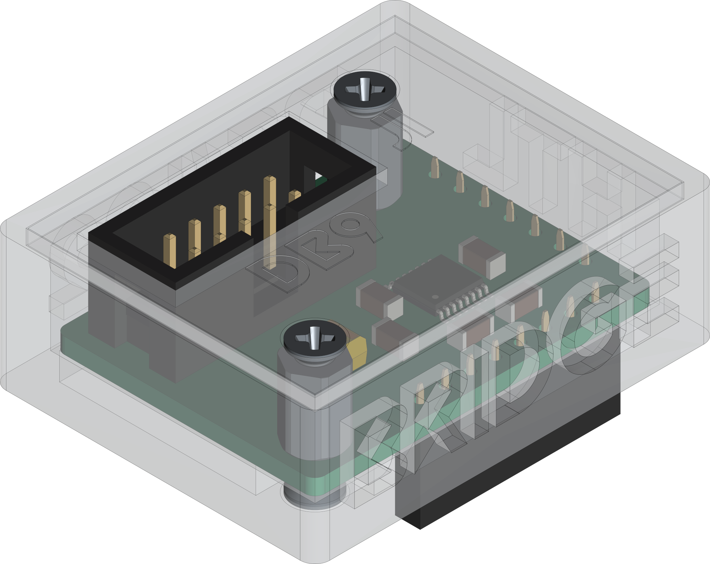
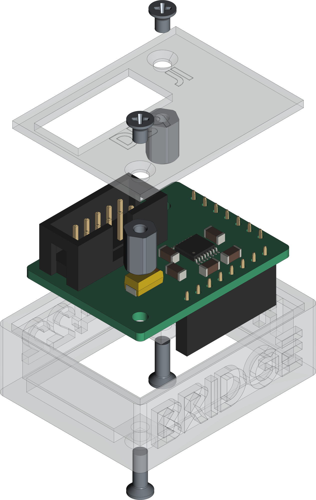

[](https://github.com/0x007e/u3a_rs422) [](https://creativecommons.org/licenses/by-nc-sa/4.0/legalcode) 

# `U3A_rs422` - RS422 - Adapter for U3A

The `U3A_rs422` project is based on a ([THVD1452](#additional-information)) that ist used to change the RX/TX signals to the required differential signal level of TIA/TIA-485-A standard. It can simply be adapted to the [U3A-Module](https://github.com/0x007e/u3a).

> To use it with a [DSUB](https://www.reichelt.de/de/de/shop/produkt/d-sub-stecker_9-pol_flachbandkabel_ohne_isolator-6987) connector it is necessary to create a connector cable that can be plugged into the IDC connector.

| Experience | Level |
|:------------|:-----:|
| Soldering   |  |
| Mechanical  |  |

# Downloads

| Type       | File               | Description              |
|:----------:|:------------------:|:-------------------------|
| Schematic  | [pdf](https://github.com/0x007E/u3a_rs422/releases/latest/download/schematic.pdf) / [cadlab](https://cadlab.io/project/29767/main/files) | Schematic files |
| Board      | [pdf](https://github.com/0x007E/u3a_rs422/releases/latest/download/pcb.pdf) / [cadlab](https://cadlab.io/project/29767/main/files) | Board file |
| Drill      | [pdf](https://github.com/0x007E/u3a_rs422/releases/latest/download/drill.pdf) | Drill file |
| PCB        | [zip](https://github.com/0x007E/u3a_rs422/releases/latest/download/kicad.zip) / [tar](https://github.com/0x007E/u3a_rs422/releases/latest/download/kicad.tar.gz) | KiCAD/Gerber/BoM/Drill files |
| Mechanical | [zip](https://github.com/0x007E/u3a_rs422/releases/latest/download/freecad.zip) / [tar](https://github.com/0x007E/u3a_rs422/releases/latest/download/freecad.tar.gz) | FreeCAD/Housing and PCB (STEP) files     |

# Hardware

There are two parts of the hardware. The pcb and the housing of the `U3A_rs422`. The pcb is created with [KiCAD](#additional-information) and the housing with [FreeCAD](#additional-information). All files are built with `github actions` so that they are ready for a production environment. The housing is printed with a 3D-printer (`Dremel 3D40`).

## PCB

The circuit board is populated on both sides (Top, Bottom). The best way for soldering the `SMD` components is within a vapor phase soldering system and for the `THT` components with a standard soldering system.

### Top Layer


### Bottom Layer


## Mechanical

The housing has a tolerance of `0.2mm` on each side of the case. So the pcb should fit perfectly in the housing. The tolerance can be modified with `FreeCAD` in the `Parameter` Spreadsheet.

### Assembled



### Exploded



# Connection/Setup

The `U3A_rs422` is powerd over the `U3A` board with `5V`. The voltage of the pins are driven by a `THVD1452` for data transmission that meets the TIA/TIA-485-A standard.

## Simple loopback setup for testing purpose

``` bash
#
#            +------------------------------------+           +-----------------------------------+      +---------------------+
#            |J1                      T         J2|           |J2     U                       +---+---+  |                     |
#         +--+--+        U3A_rs422    E        +--+--+     +--+--+    S                U      |  USB  |--+ +-----------------+ |
#     +---+ RTS-| (1) D               R        | VCC +-----+ VCC |    B      UPDI      3      +---+---+  | | TeraTerm        | |
#   L | +-+ RTS+| (2) B               M        | GND +-----+ GND |    /    +---+---+   A          |      | | ~~~~~~~~        | |
#   O +-|-+ CTS-| (3) 9               I        |  X  +-----| PDI |    U    |   |   |              |      | | ~~~~~           | |
#   O   +-+ CTS+| (4)                 N        | CTS +-----+ CTS |    A    |   |   |              |      | | ~~~~~~~~~~~~    | |
#   P     + GND | (5)                 A        | RTS +-----+ RTS |    R    | X | X |              |      | |                 | |
#   B   +-+ RXD+| (6) ~               T        | TXD +-----+ TXD |    T    +---+---+     +-+      |      | +-----------------+ |
#   A +-|-+ RXD-| (7) P   T           I        | RXD +-----+ RXD |    /                 / /       |      |                     |
#   C | +-+ TXD+| (8) W   X           O        +--+--+     +--+--+    U               +-+-+-+-+-+-+      | Computer            |
#   K +---+ TXD-| (9) R   D           N           |           |       P               | 5V  | 3V3 |      |                     |
#         +--+--+     E   E           -> 120Ω     |           |       D               +-----+-----+      +---------------------+
#            |        N   N                       |           |       I         J4                |
#            |  +---+---+---+---+---+---+---+---+ |           | +---+---+---+---+---+---+---+---+ |
#            |  | V | C | C | D | D | D | R | G | |           | | V | C | C | D | D | D | R | G | |
#            +--+ C | B | B | C | T | C | I | N +-+           +-+ C | B | B | C | T | C | I | N +-+
#               | C | 3 | 2 | D | R | R |   | D |               | C | 3 | 2 | D | R | R |   | D |
#               +---+-+-+-+-+---+---+---+---+---+               +---+-+-+-+-+---+---+---+---+---+
#                     |   |                                           |   |
#                     |   +-------------------------------------------|---+
#                     +-----------------------------------------------+
```

# Additional Information

| Type       | Link                                                  | Description                                          |
|:----------:|:-----------------------------------------------------:|:-----------------------------------------------------|
| THVD1452   | [pdf](https://www.ti.com/lit/ds/symlink/thvd1452.pdf) | UART / RS422 level converter                         |
| KiCAD      | [web](https://www.kicad.org/)                         | KiCAD project page                                   |
| FreeCAD    | [web](https://www.freecad.org/)                       | FreeCAD project page                                 |

---

R. GAECHTER
